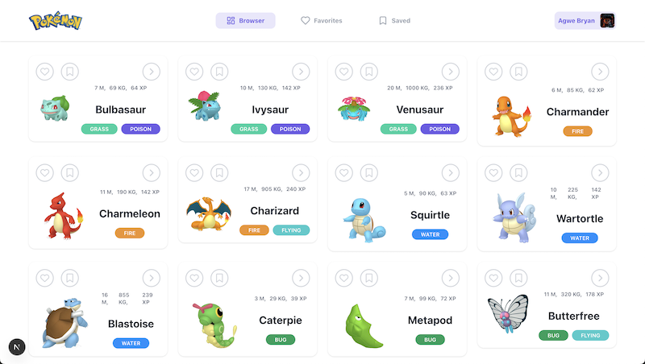

# 🧑‍💻 Pokémon Explorer

Welcome to **Pokémon Explorer** – a modern, full-stack web application that lets you browse, search, filter, and save your favorite Pokémon! Designed with a focus on user experience, performance, and clean code, this project is a showcase of my skills in building robust, scalable, and visually appealing web applications.

---

<p>
  
</p>

<p>
  
</p>

---

## 🚀 Live Demo

👉 [](https://pokemon-app-virid-eta.vercel.app/)

---

## ✨ Features

- 🔍 **Search & Filter:** Instantly search and filter Pokémon by name, type, ability, weight, height, and more.
- ❤️ **Favorites & Bookmarks:** Like and bookmark Pokémon to build your personal collection.
- 🖼️ **Beautiful UI:** Responsive, modern design with smooth animations and intuitive navigation.
- 📊 **Detailed Pokémon Info:** View comprehensive stats, abilities, and cries for each Pokémon.
- 🔐 **Authentication:** Secure login and user-specific data with Auth0.
- ⚡ **Fast & Optimized:** Leveraging Next.js for blazing-fast performance and SEO.

---

## 🛠️ Tech Stack

| Layer         | Technology                                                               |
| ------------- | ------------------------------------------------------------------------ |
| **Frontend**  | [Next.js](https://nextjs.org/) (React 19), [TypeScript](https://www.typescriptlang.org/) |
| **Styling**   | [Tailwind CSS](https://tailwindcss.com/)|
| **State**     | React Context API, Custom Hooks                                          |
| **Auth**      | [Auth0](https://auth0.com/) via `@auth0/nextjs-auth0`                   |
| **Database**  | [MongoDB](https://www.mongodb.com/) with [Mongoose](https://mongoosejs.com/) |
| **APIs**      | [PokéAPI](https://pokeapi.co/) for Pokémon data                         |
| **Dev Tools** | [ESLint](https://eslint.org/), [Prettier](https://prettier.io/), [Radix UI](https://www.radix-ui.com/), [Lucide Icons](https://lucide.dev/), [Axios](https://axios-http.com/) |

---

## ⚙️ Installation & Setup

1. **Clone the repository:**
   ```sh
   git clone https://github.com/agwebryanmuna/Pokemon-App.git
   cd Pokemon-App
   ```

2. **Install dependencies:**
   ```sh
   npm install
   ```

3. **Set up environment variables:**  
   Copy `.env.example` to `.env.local` and fill in your credentials (see below).

4. **Run the development server:**
   ```sh
   npm run dev
   ```
   Visit [http://localhost:3000](http://localhost:3000) to view the app.

---

## 🔑 Environment Variables

Create a `.env.local` file in the root directory and add the following:

```env
AUTH0_DOMAIN=your-auth0-domain
AUTH0_CLIENT_ID=your-auth0-client-id
AUTH0_CLIENT_SECRET=your-auth0-client-secret
AUTH0_SCOPE=openid profile email
AUTH0_AUDIENCE=your-auth0-audience
AUTH0_SECRET=your-auth0-secret
APP_BASE_URL=http://localhost:3000
MONGODB_URI=your-mongodb-connection-string
```

---

## 🤝 Contributing

Contributions are welcome! Please open an issue or submit a pull request for any improvements or suggestions.
---
